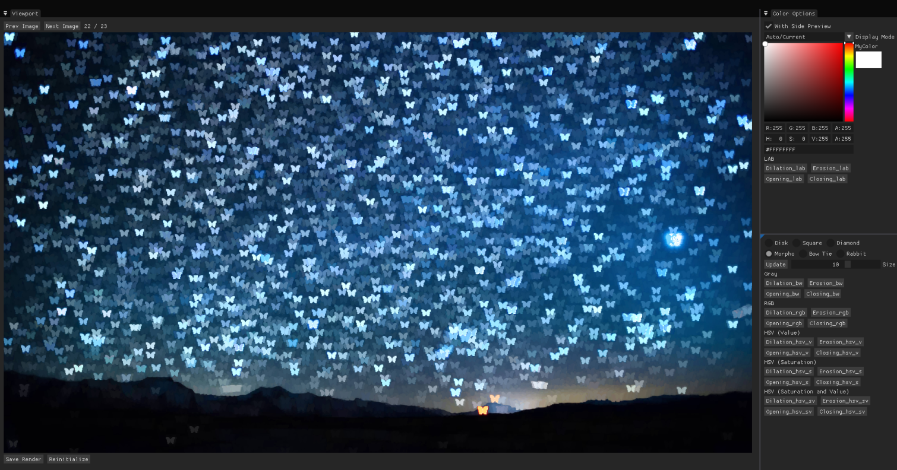

<a id="readme-top"></a>
# Mathematical Color Morphology

<br />
<div align="center">
  <a href="https://github.com/Kael-Facon/Morpho-Couleur/">
     <!-- width="80" height="80"> -->
  </a>
</div>

<!-- ABOUT THE PROJECT -->
## About The Project

The aim of this project was to propose solutions for the approach to mathematical morphology in color.

This project presents various classical mathematical morphology operations such as:
* Erosion
* Dilation
* Opening
* Closing

Along with these different shapes and sizes are available to compute these operations:
* Square
* Circle
* Diamond
* Morpho (the butterfly)
* Rabbit
* Bow-tie

Distance functions are used to compute a score for each pixels according to its neighbors. This score associated with the choosen operation help determine the new value of the pixel.
We implemented these distance functions :
* Gray (Classic Gray scale mathematical morphology)
* RGB (Simple but incorrect for value and saturation)
* HSV (Value, Saturation and a mix of both where saturation takes over value only if its bright enough)
* LAB (Computing distance from another selected color)

<p align="right">(<a href="#readme-top">back to top</a>)</p>

### Built With

The project is in CPP and the interface has been developped with IMGUI/OPGL/GLFW.
* [![Cpp][Cpp.cpp]][Cpp-url]
* [![OpenGL][OP.GL]][OPGL-url]
* [![ImGUI][IM.GUI]][IMGUI-url]
* [![GLFW][GL.FW]][GLFW-url]

## Getting Started

This project has been developped on Windows10 and Linux and should work on both. (Not tested on MacOs)

### Prerequisites

`Opengl3` and `Glfw` are required to run this project

* Windows :
You can use `vcpkg` to install `glfw`, `glew` and `glm` on windows (it's very simple to use with Jet Brains Clion)

* Linux :
[https://stackoverflow.com/questions/17768008/how-to-build-install-glfw-3-and-use-it-in-a-linux-project]

### Installation

1. Clone the repo
```sh
git clone https://github.com/Kael-Facon/Morpho-Couleur
```

2. Build
```sh
cmake -B build .
cp imgui.ini build/imgui.ini
```

3. Run
``` sh
cd build
./morpho_couleur
```

## Important Info

For a more efficient way of using DEAR IMGUI, we have created a directory in src/frontend called "imgui". This is the code of DEAR IMGUI and is NOT our code. We use this library only for some help on the creation of the app.

<!-- AUTHORS -->
## Authors
Ernest Bardon
Kael Facon

<!-- MARKDOWN LINKS & IMAGES -->
<!--5586a6-->
[OP.GL]: https://img.shields.io/badge/opengl-FFFFFF?logo=opengl&style=for-the-badge
[OPGL-url]: https://opengl.org/

[Cpp.cpp]: https://img.shields.io/badge/c++-00599C?logo=c%2B%2B&style=for-the-badge
[Cpp-url]: https://www.cppreference.com/

[IM.GUI]: https://img.shields.io/badge/IMGUI-151617?logo=imgui&style=for-the-badge&logoColor=white
[IMGUI-url]: https://github.com/ocornut/imgui

[GL.FW]: https://img.shields.io/badge/GLFW-ff9a29?logo=glfw&style=for-the-badge
[GLFW-url]: https://glfw.org/
